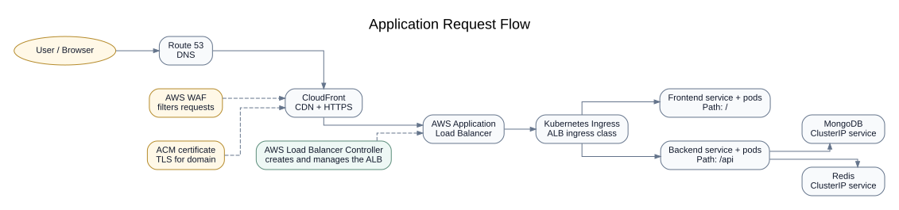

# AWS EKS Deployment Platform with Terraform

A modular Infrastructure as Code project for provisioning an AWS-based Kubernetes platform with Terraform.

The project creates an Amazon EKS environment, installs supporting platform tools with Helm, and includes sample Helm charts for a multi-tier application.

## What this project includes

- Amazon VPC with public and private subnets
- Amazon EKS cluster and managed worker nodes
- IAM integration for the AWS Load Balancer Controller
- S3 remote state with DynamoDB locking
- Argo CD and Argo CD Image Updater
- Prometheus, Grafana and Metrics Server
- Route 53, ACM, CloudFront and AWS WAF
- Helm charts for frontend, backend, MongoDB and Redis

> **Cost warning:** This project can create chargeable AWS resources such as EKS worker nodes, NAT Gateway, load balancers, CloudFront and Route 53.


Terraform provisions the platform in this order:

1. S3 and DynamoDB for Terraform state management
2. VPC, public subnets and private subnets
3. EKS cluster and worker nodes
4. IAM and IRSA configuration
5. AWS Load Balancer Controller
6. Argo CD, monitoring and other platform tools
7. Optional DNS, HTTPS, CDN and WAF services

### Application traffic flow




The AWS Load Balancer Controller watches the Kubernetes Ingress and creates the Application Load Balancer.

MongoDB and Redis use internal `ClusterIP` services and are accessible only inside the cluster.

> Replace the placeholder CloudFront origin with the actual ALB DNS name after the Kubernetes Ingress creates the load balancer.

## Repository structure

```text
.
├── main.tf
├── variables.tf
├── outputs.tf
├── providers.tf
├── backend.tf
├── backend.hcl.example
├── terraform.tfvars.example
├── deployment/
│   ├── ingress.yaml
│   ├── frontend/
│   ├── backend/
│   ├── database/
│   └── redis/
└── modules/
    ├── vpc/
    ├── eks/
    ├── iam/
    ├── bastion-host/
    ├── s3-dynamodb/
    ├── helm/
    └── waf-cdn-acm-route53/
```

## Prerequisites

Install:

- Terraform
- AWS CLI
- kubectl
- Helm

You also need:

- An AWS account
- AWS credentials configured locally
- A registered domain when using Route 53, ACM and CloudFront

Check your AWS connection:

```bash
aws sts get-caller-identity
```

## Configuration

Create a local variables file:

```bash
cp terraform.tfvars.example terraform.tfvars
```

Update the values inside `terraform.tfvars`.

Do not commit:

- `terraform.tfvars`
- Terraform state files
- AWS credentials
- Private keys
- Backend configuration containing real resource names

## Remote state setup

Terraform cannot create and use the same S3 backend during the first run.

### Step 1: Create S3 and DynamoDB

Keep the remote backend disabled during the first run.

```bash
terraform init
terraform plan -target=module.s3-dynamodb
terraform apply -target=module.s3-dynamodb
```

### Step 2: Enable the remote backend

Create your backend configuration:

```bash
cp backend.hcl.example backend.hcl
```

Add the real bucket and DynamoDB table values, then enable the backend block in `backend.tf`.

Migrate the state:

```bash
terraform init -migrate-state -backend-config=backend.hcl
```

## Deploy the infrastructure

Format and validate:

```bash
terraform fmt -recursive
terraform validate
```

Create and review the plan:

```bash
terraform plan -out=tfplan
terraform show tfplan
```

Apply:

```bash
terraform apply tfplan
```

Connect kubectl to the cluster:

```bash
aws eks update-kubeconfig \
  --region <aws-region> \
  --name <cluster-name>
```

Check the cluster:

```bash
kubectl get nodes
kubectl get pods --all-namespaces
```

## Deploy the sample application

Update the Docker image repositories and tags in the Helm values files.

```bash
helm upgrade --install database ./deployment/database
helm upgrade --install redis ./deployment/redis
helm upgrade --install backend ./deployment/backend
helm upgrade --install frontend ./deployment/frontend
kubectl apply -f deployment/ingress.yaml
```

Verify:

```bash
kubectl get deployments
kubectl get pods
kubectl get services
kubectl get ingress
```

## Verify platform services

```bash
kubectl get pods -n kube-system
kubectl get pods -n argocd
kubectl get pods -n monitor
```

View Terraform outputs:

```bash
terraform output
```

## Destroy the environment

Delete the application and Ingress first so AWS can remove the load balancer dependencies.

```bash
helm uninstall frontend backend database redis || true
kubectl delete -f deployment/ingress.yaml --ignore-not-found
terraform destroy
```

After destruction, confirm that load balancers, target groups, network interfaces and security groups are no longer attached to the VPC.

## Project highlights

- Built modular Terraform code for AWS infrastructure
- Provisioned Amazon EKS, VPC, IAM and supporting services
- Configured S3 remote state with DynamoDB locking
- Installed Kubernetes platform tools using Helm
- Added GitOps, monitoring and application deployment components

## Author

**Sujith Mypati**  